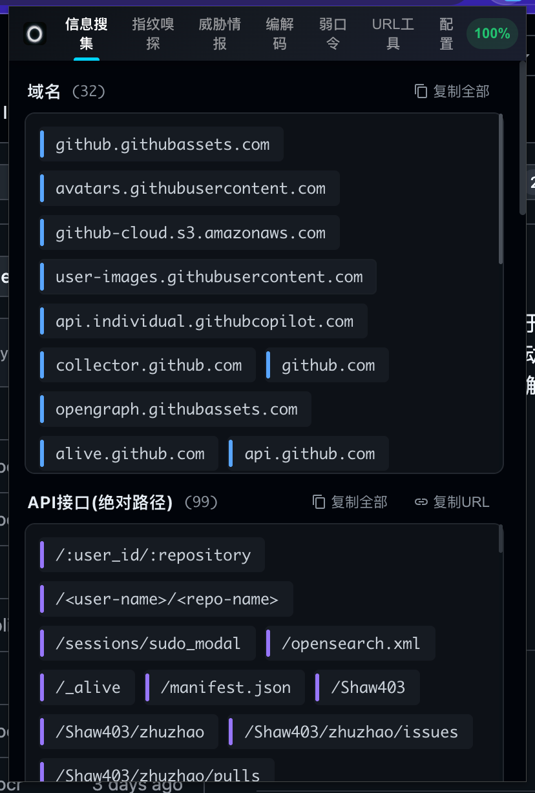
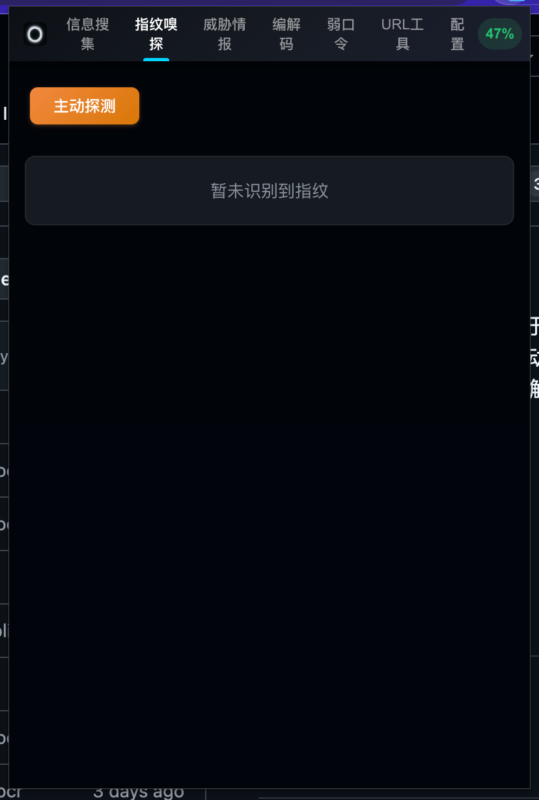
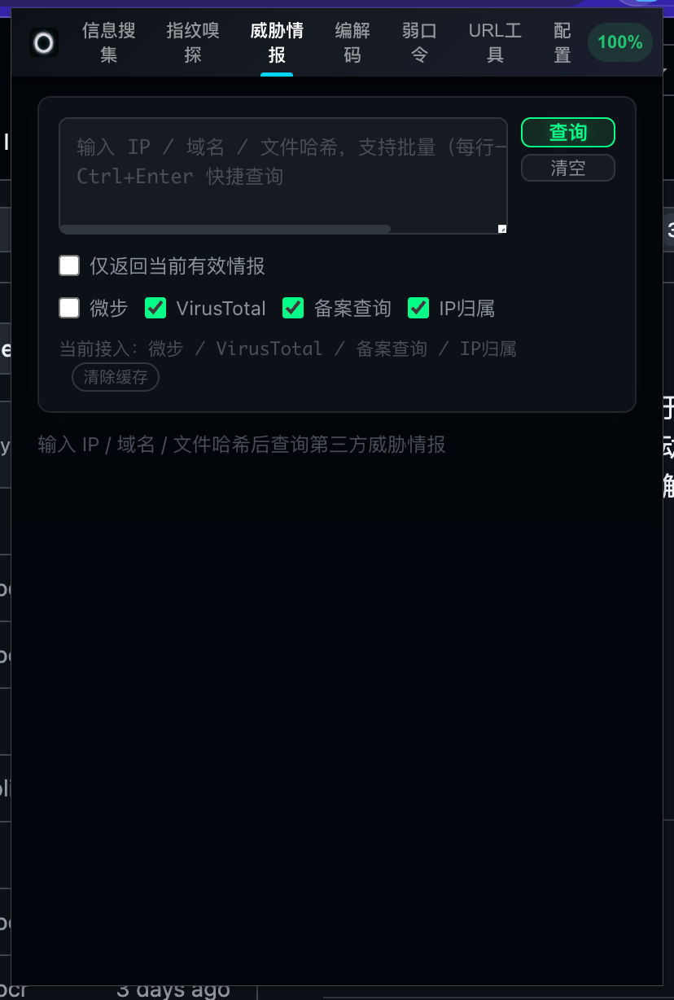
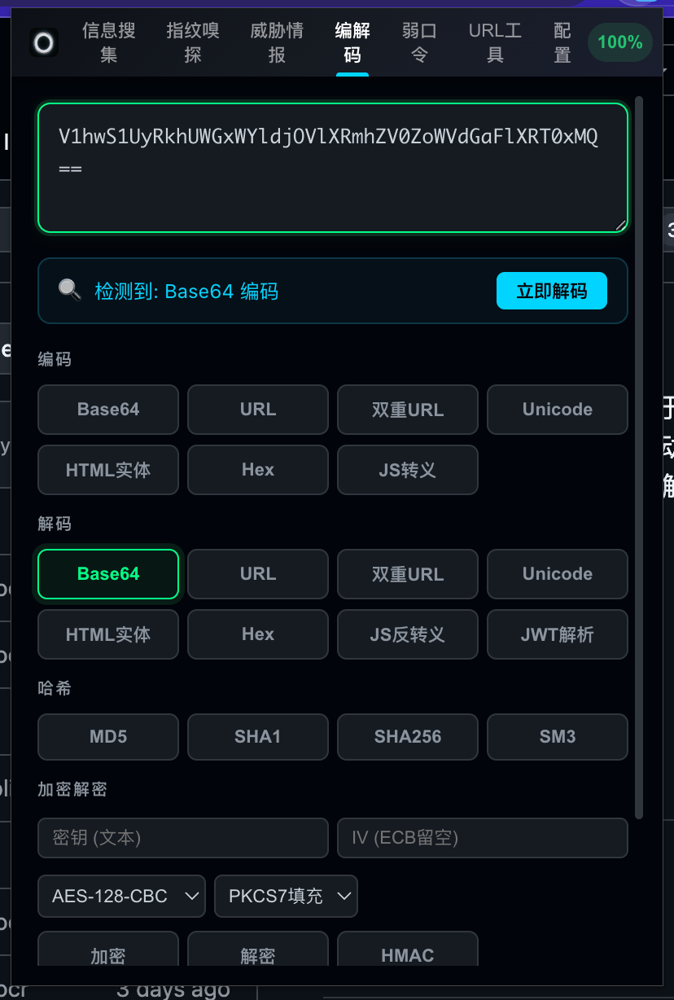
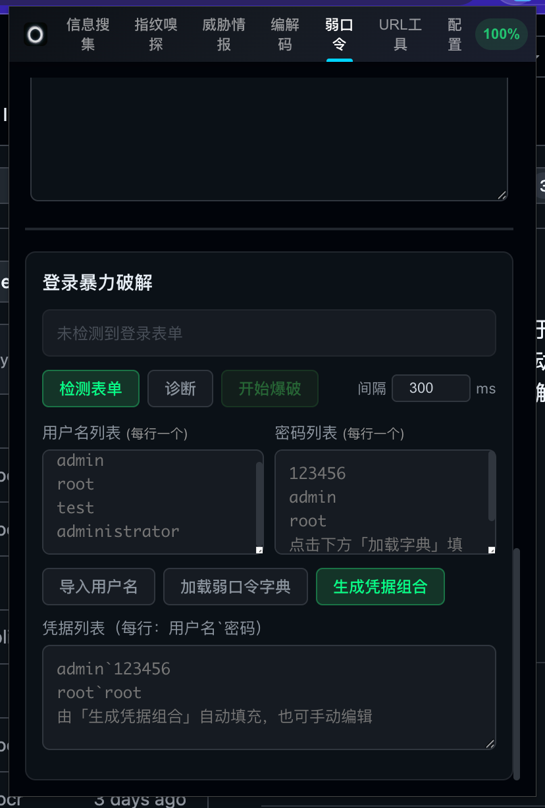

# 烛照 (Zhuzhao)

> 以一烛之光，照见隐秘

一款面向安全研究人员的 Chrome 浏览器扩展，基于 [SnowEyes](https://github.com/SickleSec/SnowEyes) 二次开发，在原有被动信息检测与指纹识别能力基础上，新增了**主动指纹嗅探、威胁情报检索、编解码与加解密、JS 加密绕过 Web 爆破**等核心能力。

## ✨ 功能特性

### 🔍 被动信息搜集

自动解析页面与 JS 文件，提取以下敏感信息：

- API 接口路径、绝对路径、模块文件
- IP 地址、域名、URL、GitHub 仓库链接
- 手机号、邮箱、身份证号、JWT Token
- 公司名称、Cookie、密码特征、云密钥
- Windows 本地路径泄露



### 🧬 指纹识别

- **被动指纹** - 基于页面内容、响应头、JS 特征识别 CMS/框架/中间件（覆盖 2000+ 指纹规则）
- **主动指纹嗅探** - 向目标发送指定路径探针（如 `/nacos/`、`/druid/index.html`、`/swagger-ui.html`），根据响应状态码和关键词判断组件是否存在，覆盖常见 OA、面板、框架、漏洞接口、信息泄露路径
- 支持自定义指纹规则，可通过 UI 绑定 `finger.json` 文件进行增删改



### 🛡️ 威胁情报检索

集成多平台威胁情报，支持批量查询（最多 100 条）：

| 平台 | 支持类型 | 说明 |
|------|---------|------|
| **微步在线 (ThreatBook)** | IP | 信誉评分、恶意标签、实时判定 |
| **VirusTotal** | IP / 域名 / Hash (MD5/SHA1/SHA256) | 多引擎检测结果、标签分类 |
| **IP 归属查询** | IP | 地理位置、ASN 信息 |
| **ICP 备案查询** | 域名 | 备案号、主办单位 |

情报标签覆盖：恶意软件、僵尸网络、C2、钓鱼、挖矿、Tor、代理、VPN、扫描器、漏洞利用、勒索软件、APT 攻击等。



### 🔐 编解码与加解密

内置完整的编解码和密码学工具，支持自动识别输入格式：

**编解码：**
- Base64 编解码
- URL 编解码
- Unicode 编解码（`\uXXXX`）
- Hex 十六进制编解码
- HTML Entity 编解码

**哈希算法：**
- MD5
- SHA-1
- SHA-256
- HMAC-SHA256

**对称加密：**
- AES 加密/解密（支持 CBC / GCM 模式，PKCS7 填充）
- DES 加密/解密

**其他：**
- JWT Token 解析（Header / Payload / Signature 拆解）



### 💥 JS 加密绕过 Web 爆破

针对登录场景的自动化爆破模块，具备以下能力：

- **CSRF Token 自动提取** - 识别页面中 CSRF 隐藏字段，每次请求前自动刷新
- **JS 加密绕过** - 通过 Content Script 注入，直接调用页面的加密函数完成密码加密后再提交，绕过前端 JS 加密保护
- **验证码自动识别** - 集成 ddddocr OCR 引擎，自动识别图形验证码
- **登录状态智能判断** - 基于 Token 变化、页面跳转、关键词匹配（支持中英文）综合判断成功/失败
- **自定义弱口令字典** - 内置弱口令库，支持按年份范围、企业后缀等维度生成定向字典
- **多并发请求** - 可配置并发数和请求间隔，平衡速度与稳定性
- **断点续跑** - 爆破进程在后台 Service Worker 中运行，关闭弹窗不会中断



### 🤖 AI 智能分析

集成大语言模型接口，支持对当前页面内容进行安全分析辅助。

### 📊 URL 工具集

URL 编解码、路径分析、参数提取等实用工具。

## 📦 安装方式

### 开发者模式安装

1. 克隆本仓库
   ```bash
   git clone https://github.com/YOUR_USERNAME/zhuzhao.git
   ```
2. 安装依赖并构建
   ```bash
   npm install
   npm run build
   ```
3. 打开 Chrome，访问 `chrome://extensions/`
4. 开启右上角「开发者模式」
5. 点击「加载已解压的扩展程序」，选择项目根目录或 `dist` 目录

## 🛠️ 开发

```bash
# 安装依赖
npm install

# 开发模式（监听文件变化自动构建）
npm run dev

# 生产构建
npm run build
```

## 🔧 验证码识别（可选）

爆破模块的验证码识别依赖 ddddocr 本地服务：

```bash
pip3 install ddddocr
python3 captcha_server.py
```

服务默认监听 `http://127.0.0.1:19876`，仅在爆破含验证码的登录页面时需要。

## 📁 项目结构

```
├── background.js              # Service Worker 后台脚本
├── content.js                 # Content Script（被动信息提取 + 指纹识别）
├── popup.html/js/css          # 弹出窗口界面
├── ai-analysis.js             # AI 分析模块
├── bruteforce.js              # 爆破模块（CSRF/JS加密绕过/验证码识别）
├── urltools.js                # URL 工具模块
├── captcha_server.py          # ddddocr 验证码识别服务
├── finger-deep-optimized.json # 指纹数据库（被动识别）
├── finger24-headers.json      # Header 指纹数据库
├── active-fingerprints.json   # 主动指纹探测规则
├── WeakPass.yaml              # 弱口令字典
├── src/                       # 源码目录
│   ├── background/            # 后台模块（指纹检测、消息通信）
│   ├── content/               # 内容脚本（DOM扫描、JS提取）
│   ├── popup/                 # 弹窗 UI 逻辑
│   └── utils/                 # 工具函数
```

## 🙏 致谢

- [SnowEyes](https://github.com/SickleSec/SnowEyes) - 原始项目

## 📄 免责声明

本项目仅供学习和授权安全测试使用。使用者应遵守当地法律法规，对使用本工具造成的任何后果自行承担责任。严禁用于未授权的渗透测试和非法用途。
